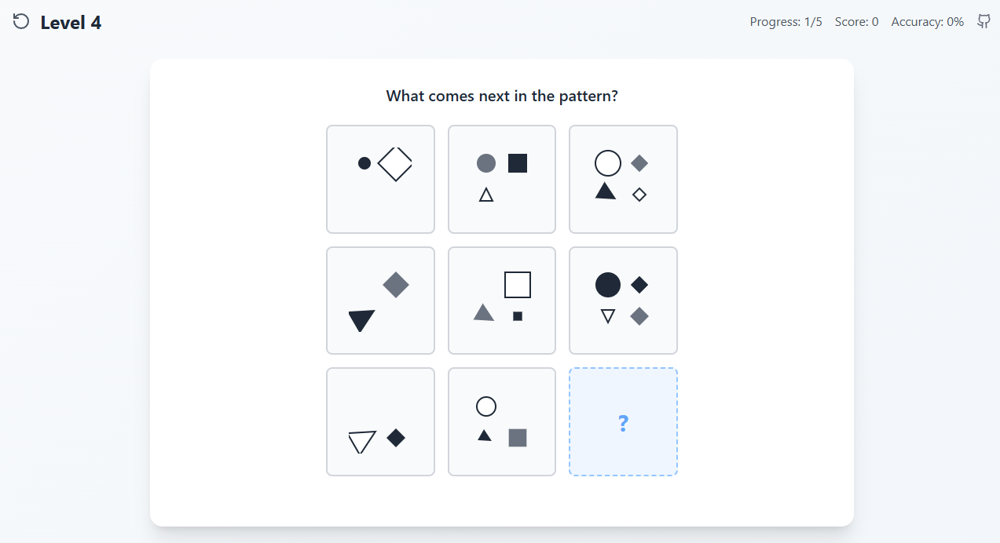

# RPM IQ Exam 🧠

[](https://opensource.org/licenses/MIT)
[](https://github.com/yuis-ice/rpm-iq-exam/issues)
[](https://github.com/yuis-ice/rpm-iq-exam/stargazers)
[](https://rpmtest.pages.dev/)

An IQ Test SPA Application compatible with Raven's Progressive Matrices (RPM) puzzles

## 🚀 [Live Demo](https://rpmtest.pages.dev/)

Try the RPM IQ Exam now at **https://rpmtest.pages.dev/**

## 📷 Screenshot



*Example of Level 4 puzzle - identify the pattern and select the missing piece*

## 📖 Overview

RPM IQ Exam is a modern Single Page Application (SPA) based on Raven's Progressive Matrices tests. It provides scientifically validated pattern recognition tests to measure cognitive abilities and reasoning skills.

### Key Features

- 🧩 **Authentic RPM Puzzles**: Scientifically validated pattern-based questions
- 🎯 **Adaptive Testing**: Difficulty adjustment based on user ability
- 📊 **Detailed Analysis**: Comprehensive results and performance analytics
- 📱 **Responsive Design**: Optimal experience on all devices
- ♿ **Accessibility**: WCAG 2.1 compliant inclusive design
- 🌐 **Multi-language Support**: English and Japanese supported
- 🎨 **Modern UI**: Intuitive and beautiful user interface

## 🚀 Quick Start

### Prerequisites

- Node.js 18.0 or higher
- npm or yarn

### Installation

```bash
# Clone the repository
git clone https://github.com/yuis-ice/rpm-iq-exam.git

# Navigate to project directory
cd rpm-iq-exam

# Install dependencies
npm install

# Start development server
npm run dev
```

### Build

```bash
# Production build
npm run build

# Preview build
npm run preview
```

## 🎮 How to Use

1. **Start Test**: Begin the test from the main page
2. **Answer Questions**: Select the optimal answer from the presented patterns
3. **Progress**: Automatically advance to the next question after each answer
4. **View Results**: Check detailed analysis results after test completion

### About RPM Puzzles

Raven's Progressive Matrices:
- Measure pattern recognition abilities
- Language-independent intelligence test
- Scientifically recognized indicator of fluid intelligence
- Widely used in education, psychology, and HR fields

## 🏗️ Tech Stack

- **Frontend**: React 18
- **TypeScript**: Type-safe development
- **Build Tool**: Vite
- **Styling**: CSS Modules / Styled Components
- **State Management**: React Context / Zustand
- **Testing**: Jest, React Testing Library
- **Linting**: ESLint, Prettier

## 📁 Project Structure

```
src/
├── components/        # Reusable components
├── pages/            # Page components
├── hooks/            # Custom hooks
├── utils/            # Utility functions
├── types/            # TypeScript type definitions
├── styles/           # Global styles
├── assets/           # Static assets
└── tests/            # Test files
```

## 🧪 Testing

```bash
# Run all tests
npm run test

# Run tests in watch mode
npm run test:watch

# Generate test coverage
npm run test:coverage
```

## 🤝 Contributing

We welcome contributions to the project! Please see our [Contributing Guide](CONTRIBUTING.md) for details.

### Development Workflow

1. Fork this repository
2. Create a feature branch (`git checkout -b feature/amazing-feature`)
3. Commit your changes (`git commit -m 'Add amazing feature'`)
4. Push to the branch (`git push origin feature/amazing-feature`)
5. Create a Pull Request

## 📝 License

This project is released under the [MIT License](LICENSE).

## 🔒 Security

If you discover a security issue, please report it following our [Security Policy](.github/SECURITY.md).

## 📞 Support

- 🐛 Bug Reports: [Issue Tracker](https://github.com/yuis-ice/rpm-iq-exam/issues)
- 💬 Questions & Discussions: [Discussions](https://github.com/yuis-ice/rpm-iq-exam/discussions)
- 📚 Documentation: [Wiki](https://github.com/yuis-ice/rpm-iq-exam/wiki)

## 🎯 Roadmap

- [ ] Additional puzzle types
- [ ] Detailed statistics and progress tracking
- [ ] Custom test configuration
- [ ] Team/organization features
- [ ] API integration capabilities
- [ ] Data export functionality

## 🙏 Acknowledgments

- Raven's Progressive Matrices researchers
- Open source community
- All contributors

## 📊 Statistics


---

**Experience better cognitive assessment with RPM IQ Exam!** 🚀